

<h1>Project 3 results visualization</h1>

 
Accuracy (mean of diagonal of confusion matrix) is 0.5667

#Experiment 
*Tiny image + k nearest neighbor
By iterating over k from 5 to 15, Found an optimized parameter k=14 with accuracy : 0.08

* Method explanation :
1. Tiny image function resizes the original image into 16 * 16 pixels although it losses a lot of information but is is an easy way to serve as features, because it doesn't cause much computation resources.
2. k nearest neighbor merely compares the test data features to each of the train data and find the top k nearest data points. After we select k nearest data, each of the data represents a catagory such as "kitchen". Then vote for the most likely catagory

* Vocabulary building
* bag of sift + k nearest neighbor:
In bag of sift + k nearest neighbor, I iterated the step in the vl_dsift(img,'step',step) and found it reach the optimal value at step = 20
with accuracy : 0.1287

* Method explanation :
bag of sift method first build a vocabulary by classifying the descriptors (default: 400 dimensions)
then in the testing pattern count the porpotion of the 

#tried extra credits
##Experimental design extra credit:
Experiment with many different vocabulary sizes and report performance:
(with setting :
sift_sample_bow=0.9;
sift_sample_vocab=0.3;
lambda=0.00001;
)
the confusion matrix result given order:
<table border=0 cellpadding=4 cellspacing=1>
<tr>
<th><th colspan=2> with accuracy 0.348</th>
<th> 0.442</th>
<th colspan=2>with accuracy 0.514</th>
<th colspan=2>with accuracy 0.547</th>
<th colspan=2>with accuracy 0.561</th>
<th colspan=2>with accuracy 0.573</th>
<th colspan=2>with accuracy 0.589</th>
</tr>
</table>
##Randomly pick 100 training and 100 testing images for each iteration 
Accuracy of 30 trails of randomly picking 100 testing and training samples (the random method is used in the  get_image_paths_rand.m function which outputs 100 sets of both test set and train set)

<table border=0 cellpadding=4 cellspacing=1>
<tr>
<th>0.50</th>
<th>0.46</th>
<th colspan=2>0.64</th>
<th colspan=2>0.54</th>
<th colspan=2>0.66</th>
<th colspan=2>0.65</th>
</tr>
<tr>
<th>0.57</th>
<th>0.52</th>
<th colspan=2>0.68</th>
<th colspan=2>0.67</th>
<th colspan=2>0.73</th>
<th colspan=2>0.61</th>
</tr>
<tr>
<th>0.55</th>
<th>0.53</th>
<th colspan=2>0.66</th>
<th colspan=2>0.62</th>
<th colspan=2>0.49</th>
<th colspan=2>0.69</th>
</tr>
<tr>
<th>0.74</th>
<th>0.61</th>
<th colspan=2>0.42</th>
<th colspan=2>0.58</th>
<th colspan=2>0.63</th>
<th colspan=2>0.56</th>
</tr>
<tr>
<th>0.74</th>
<th>0.63</th>
<th colspan=2>0.53</th>
<th colspan=2>0.57</th>
<th colspan=2>0.66</th>
<th colspan=2>0.68</th>
</tr>
then get average : 0.6013
std: 0.0828
Not a bad result but merely for a pilot test
</table>

##Train the SVM with more sophisticated kernels
with the use of function:
primal_svm(1,trainy(:,i),lambda,opt);

* kernel types:
nonlinear conjugate gradients: accuracy=0.5340
newton step:0.5507
linear newton step: 0.5307

<table border=0 cellpadding=4 cellspacing=1>
<tr>
<th>Category name</th>
<th>Accuracy</th>
<th colspan=2>Sample training images</th>
<th colspan=2>Sample true positives</th>
<th colspan=2>False positives with true label</th>
<th colspan=2>False negatives with wrong predicted label</th>
</tr>
<tr>
<td>Kitchen</td>
<td>0.460</td>
<td bgcolor=LightBlue>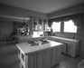</td>
<td bgcolor=LightBlue>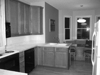</td>
<td bgcolor=LightGreen></td>
<td bgcolor=LightGreen>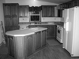</td>
<td bgcolor=LightCoral> <small>InsideCity</small></td>
<td bgcolor=LightCoral> <small>LivingRoom</small></td>
<td bgcolor=#FFBB55> <small>Office</small></td>
<td bgcolor=#FFBB55>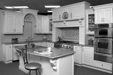 <small>InsideCity</small></td>
</tr>
<tr>
<td>Store</td>
<td>0.360</td>
<td bgcolor=LightBlue></td>
<td bgcolor=LightBlue></td>
<td bgcolor=LightGreen>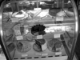</td>
<td bgcolor=LightGreen>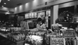</td>
<td bgcolor=LightCoral> <small>LivingRoom</small></td>
<td bgcolor=LightCoral> <small>InsideCity</small></td>
<td bgcolor=#FFBB55>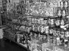 <small>Forest</small></td>
<td bgcolor=#FFBB55> <small>InsideCity</small></td>
</tr>
<tr>
<td>Bedroom</td>
<td>0.280</td>
<td bgcolor=LightBlue></td>
<td bgcolor=LightBlue></td>
<td bgcolor=LightGreen>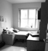</td>
<td bgcolor=LightGreen></td>
<td bgcolor=LightCoral> <small>LivingRoom</small></td>
<td bgcolor=LightCoral> <small>Industrial</small></td>
<td bgcolor=#FFBB55>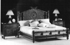 <small>InsideCity</small></td>
<td bgcolor=#FFBB55>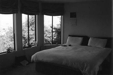 <small>Kitchen</small></td>
</tr>
<tr>
<td>LivingRoom</td>
<td>0.180</td>
<td bgcolor=LightBlue></td>
<td bgcolor=LightBlue></td>
<td bgcolor=LightGreen></td>
<td bgcolor=LightGreen></td>
<td bgcolor=LightCoral> <small>Kitchen</small></td>
<td bgcolor=LightCoral> <small>Store</small></td>
<td bgcolor=#FFBB55> <small>Kitchen</small></td>
<td bgcolor=#FFBB55> <small>Mountain</small></td>
</tr>
<tr>
<td>Office</td>
<td>0.910</td>
<td bgcolor=LightBlue></td>
<td bgcolor=LightBlue></td>
<td bgcolor=LightGreen></td>
<td bgcolor=LightGreen></td>
<td bgcolor=LightCoral> <small>Bedroom</small></td>
<td bgcolor=LightCoral> <small>LivingRoom</small></td>
<td bgcolor=#FFBB55> <small>Bedroom</small></td>
<td bgcolor=#FFBB55> <small>Kitchen</small></td>
</tr>
<tr>
<td>Industrial</td>
<td>0.330</td>
<td bgcolor=LightBlue></td>
<td bgcolor=LightBlue></td>
<td bgcolor=LightGreen></td>
<td bgcolor=LightGreen></td>
<td bgcolor=LightCoral> <small>Street</small></td>
<td bgcolor=LightCoral>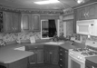 <small>Kitchen</small></td>
<td bgcolor=#FFBB55> <small>Highway</small></td>
<td bgcolor=#FFBB55> <small>TallBuilding</small></td>
</tr>
<tr>
<td>Suburb</td>
<td>0.910</td>
<td bgcolor=LightBlue>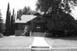</td>
<td bgcolor=LightBlue></td>
<td bgcolor=LightGreen></td>
<td bgcolor=LightGreen></td>
<td bgcolor=LightCoral> <small>Highway</small></td>
<td bgcolor=LightCoral> <small>Industrial</small></td>
<td bgcolor=#FFBB55>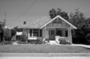 <small>Coast</small></td>
<td bgcolor=#FFBB55> <small>InsideCity</small></td>
</tr>
<tr>
<td>InsideCity</td>
<td>0.540</td>
<td bgcolor=LightBlue></td>
<td bgcolor=LightBlue></td>
<td bgcolor=LightGreen></td>
<td bgcolor=LightGreen></td>
<td bgcolor=LightCoral> <small>Highway</small></td>
<td bgcolor=LightCoral>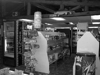 <small>Store</small></td>
<td bgcolor=#FFBB55>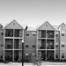 <small>Suburb</small></td>
<td bgcolor=#FFBB55> <small>Office</small></td>
</tr>
<tr>
<td>TallBuilding</td>
<td>0.670</td>
<td bgcolor=LightBlue>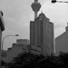</td>
<td bgcolor=LightBlue></td>
<td bgcolor=LightGreen></td>
<td bgcolor=LightGreen></td>
<td bgcolor=LightCoral> <small>Industrial</small></td>
<td bgcolor=LightCoral> <small>InsideCity</small></td>
<td bgcolor=#FFBB55> <small>Suburb</small></td>
<td bgcolor=#FFBB55> <small>Highway</small></td>
</tr>
<tr>
<td>Street</td>
<td>0.420</td>
<td bgcolor=LightBlue></td>
<td bgcolor=LightBlue></td>
<td bgcolor=LightGreen></td>
<td bgcolor=LightGreen></td>
<td bgcolor=LightCoral> <small>TallBuilding</small></td>
<td bgcolor=LightCoral> <small>Industrial</small></td>
<td bgcolor=#FFBB55> <small>InsideCity</small></td>
<td bgcolor=#FFBB55> <small>Store</small></td>
</tr>
<tr>
<td>Highway</td>
<td>0.730</td>
<td bgcolor=LightBlue></td>
<td bgcolor=LightBlue></td>
<td bgcolor=LightGreen></td>
<td bgcolor=LightGreen></td>
<td bgcolor=LightCoral>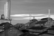 <small>Industrial</small></td>
<td bgcolor=LightCoral> <small>Street</small></td>
<td bgcolor=#FFBB55> <small>Coast</small></td>
<td bgcolor=#FFBB55>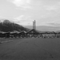 <small>Coast</small></td>
</tr>
<tr>
<td>OpenCountry</td>
<td>0.250</td>
<td bgcolor=LightBlue></td>
<td bgcolor=LightBlue></td>
<td bgcolor=LightGreen></td>
<td bgcolor=LightGreen>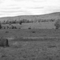</td>
<td bgcolor=LightCoral>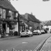 <small>Street</small></td>
<td bgcolor=LightCoral> <small>Highway</small></td>
<td bgcolor=#FFBB55> <small>Suburb</small></td>
<td bgcolor=#FFBB55> <small>Mountain</small></td>
</tr>
<tr>
<td>Coast</td>
<td>0.820</td>
<td bgcolor=LightBlue></td>
<td bgcolor=LightBlue></td>
<td bgcolor=LightGreen>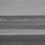</td>
<td bgcolor=LightGreen></td>
<td bgcolor=LightCoral> <small>OpenCountry</small></td>
<td bgcolor=LightCoral> <small>InsideCity</small></td>
<td bgcolor=#FFBB55> <small>OpenCountry</small></td>
<td bgcolor=#FFBB55> <small>Forest</small></td>
</tr>
<tr>
<td>Mountain</td>
<td>0.690</td>
<td bgcolor=LightBlue></td>
<td bgcolor=LightBlue></td>
<td bgcolor=LightGreen></td>
<td bgcolor=LightGreen></td>
<td bgcolor=LightCoral> <small>Store</small></td>
<td bgcolor=LightCoral> <small>Forest</small></td>
<td bgcolor=#FFBB55> <small>TallBuilding</small></td>
<td bgcolor=#FFBB55> <small>Coast</small></td>
</tr>
<tr>
<td>Forest</td>
<td>0.950</td>
<td bgcolor=LightBlue></td>
<td bgcolor=LightBlue></td>
<td bgcolor=LightGreen></td>
<td bgcolor=LightGreen></td>
<td bgcolor=LightCoral> <small>InsideCity</small></td>
<td bgcolor=LightCoral>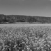 <small>OpenCountry</small></td>
<td bgcolor=#FFBB55> <small>Mountain</small></td>
<td bgcolor=#FFBB55> <small>Mountain</small></td>
</tr>
<tr>
<th>Category name</th>
<th>Accuracy</th>
<th colspan=2>Sample training images</th>
<th colspan=2>Sample true positives</th>
<th colspan=2>False positives with true label</th>
<th colspan=2>False negatives with wrong predicted label</th>
</tr>
</table>

